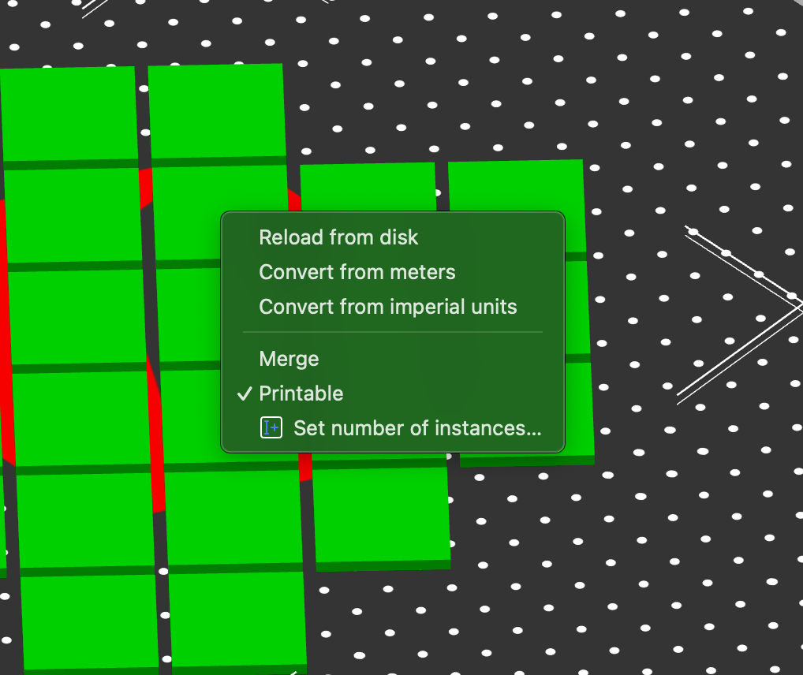
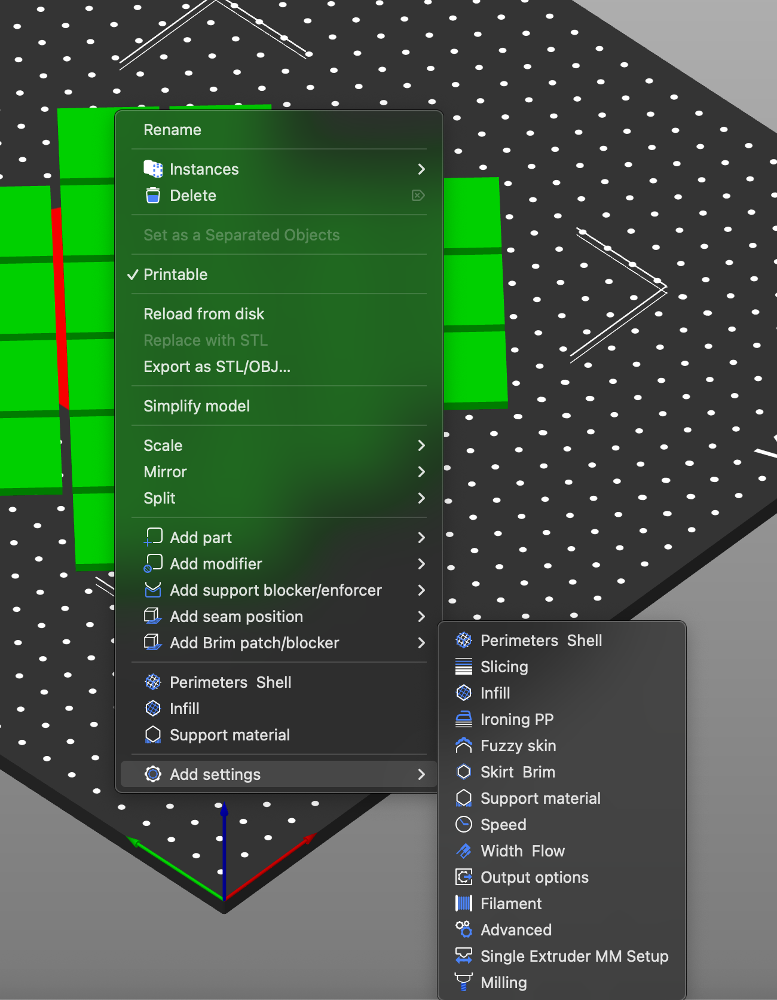
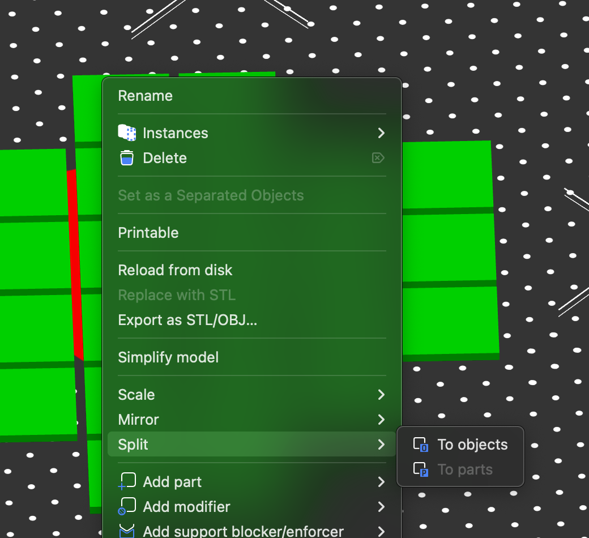
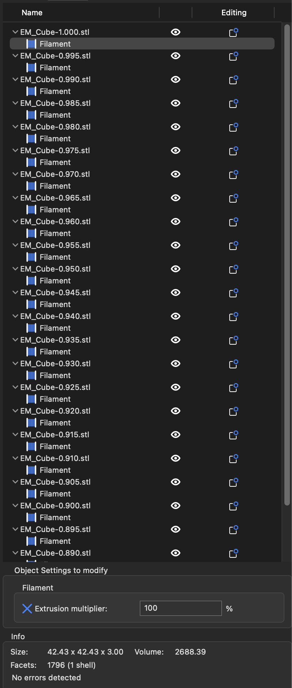

# Adding per part settings to mutliple parts at once

This is a bit of a workaround for this feature not being implimented.

Steps to follow:

1) Add parts to the build plate
2) Select all of the parts that you want to have a setting or settings added for.
3) Right click on the parts and then click `Merge`
   
4) Once the parts are combined, right click on the part and then add the setting(s) that you want.
   
5) After you are done adding settings, right click on the part again, and then click `Split` > `To objects`
   

What you will be left with is something like the screenshot below showing a separate setting available for each object you had originally merged.

Credit to --Nikita Beknel-- on the SuperSlicer discord for this one.
