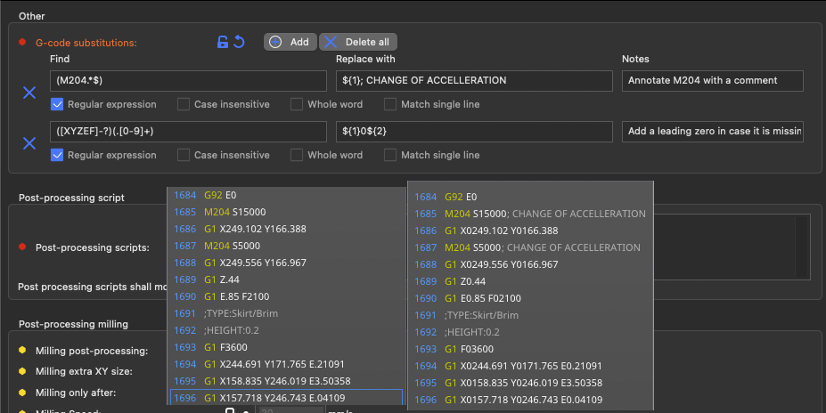

# G-code substitutions

SuperSlicer offers simple G-Code post-processing by specifying find and replace pairs, with optional regex matching, case sensitivity and whole word matching, similar to what common text editors offer. Regular expressions are very powerful and versatile tool that allows to set up even quite complicated substitutions. If you need more complicated post-processing, it is possible to use an [external post-processing script](post-processing-scripts.md) instead.

The feature accessible from **Print Settings -> Output options**.

The G-Code is processed before it is previewed, so your changes will be visible in the G-Code preview. It may be helpful to turn on 'Verbose G-Code' to make SuperSlicer generate extra annotations, which you can then match with a regex.

## Regular expression syntax

Regular expression syntax of Perl is supported as described in [boost Perl regular expression syntax](https://www.boost.org/doc/libs/1_78_0/libs/regex/doc/html/boost_regex/syntax/perl_syntax.html), where a "single line" modifier mimics the Perl's **_s/_** modifier. With regular expressions active, the "Replace with" pattern supports the "extended" syntax as described in [boost extended format syntax](https://www.boost.org/doc/libs/1_78_0/libs/regex/doc/html/boost_regex/format/boost_format_syntax.html). [Lookahead and lookbehind](https://www.w3docs.com/learn-javascript/lookahead-and-lookbehind.html) are supported by the regular expression engine, but only for fixed length patterns. With regular expression disabled, **_n__, r, t_**, and placeholders are supported in both "Find" and "Replace with" patterns similarly to Notepad++'s "extended" syntax.

The G-code find/replace post-processor processes G-code in blocks, where a single G-code block is generated for each layer starting with the Z up to move to the next layer. Multiple find/replace patterns are applied one by one to one G-code block before processing the next G-code block. Matching multi-line patterns is possible, however only inside one G-code block, most likely inside a single layer. Regular expressions are powerful but tricky, thus we recommend the [regular expressions 101 online playground](https://regex101.com/) to get familiar with regular expressions and to test and fine tune the regular expressions modifying G-code before entering them into SuperSlicer. Don't forget to switch the regex flavor to ECMAScript in the regular expressions 101 online playground.

## Example

An example of a quite powerful G-code modification by a reasonably complex regular expression: Increase the extrusion rate of top solid infill from the default 95 percent to 98 percent.  
Find: `(;TYPE:Top solid infilln)(.*?)(;TYPE:|$)(?!Top solid infill)`  
Replace with: `${1}M221 S98n${2}M221 S95n${3}`  
Modifiers: _**regexp, single line**_

---

!!! info "License attribution"

    This [page](https://help.prusa3d.com/article/g-code-substitutions_301694) is originally from the PrusaSlicer documentation