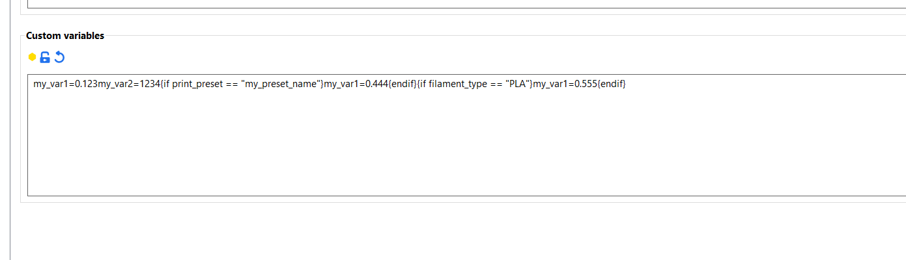
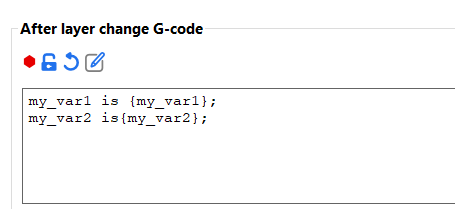
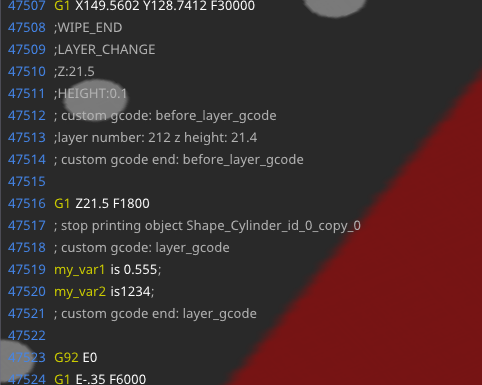

# Using Custom Variables

You can add custom variables into "print settings/filament settings/printer settings in the `notes` area. 

## Syntax
```
my_var1=0.123 my_var2=1234  {if print_preset == "my_preset_name"} my_var1=0.444 {endif} {if filament_type == "PLA"} my_var1=0.555 {endif}
```

```
my_var1 is {my_var1}; my_var2 is{my_var2};
```

## Examples



## Results:
