# Preferences

SuperSlicer Preferences.

### Accessing preferences:

Windows:

Mac: 

	UI: Top Menu bar >  
	
	Hotkey: `CMD+,`

Linux:

---

## General

General application preferences

---

### Automation

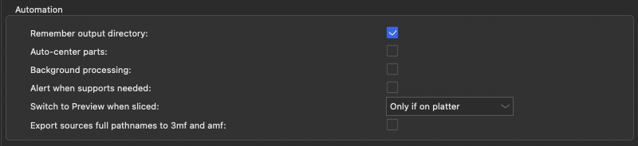

#### Remember output directory

If this is enabled SuperSlicer will prompt the last output directory instead of the one containing the input files.

Default value: true

Parameter name: remember_output_path
#### Auto-center parts

Default value: false

Parameter name: autocenter
#### Background processing

Default value: false

Parameter name: autocenter
#### Alert when supports needed

Default value: false

Parameter name: autocenter
#### Switch to Preview when sliced

Default value: false

Parameter name: autocenter
#### Export sources full pathnames to 3mf and amf

Default value: false

Parameter name: autocenter
### Presets and Updates

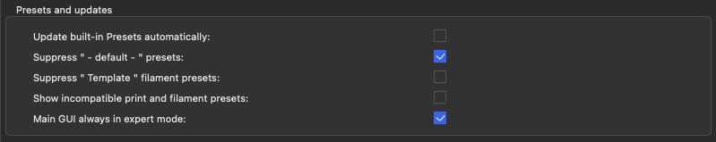

### Files

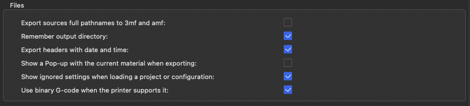

### Dialogs

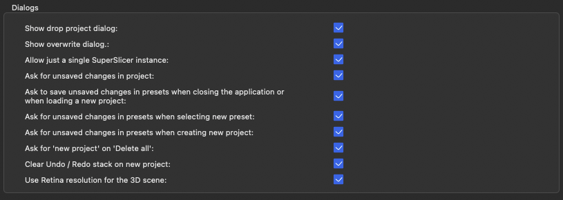

### Download Path

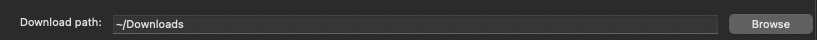

### Application font size

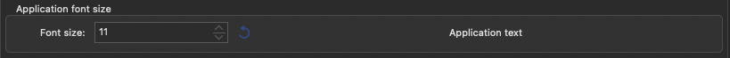

### Paths

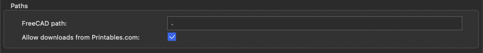

## Camera

---

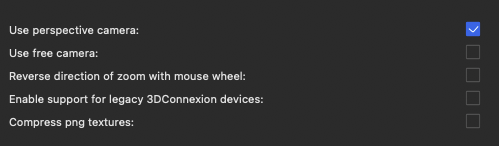

## GUI

---

### Controls

### Appearances

### Layout Options

### Settings layout and colors

### Splash screen

## Colors

---

### Dark Mode

!!! note

    This is only available on Windows.
    Linux and MacOS follow the system setting for Dark/Light mode for the application

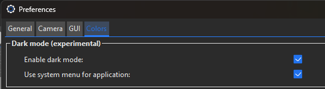

### GUI colors

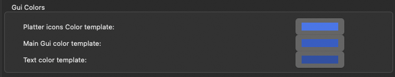

### Text colors

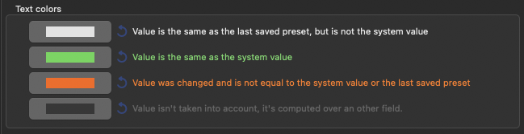

### Mode markers

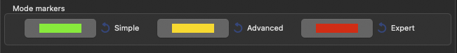

