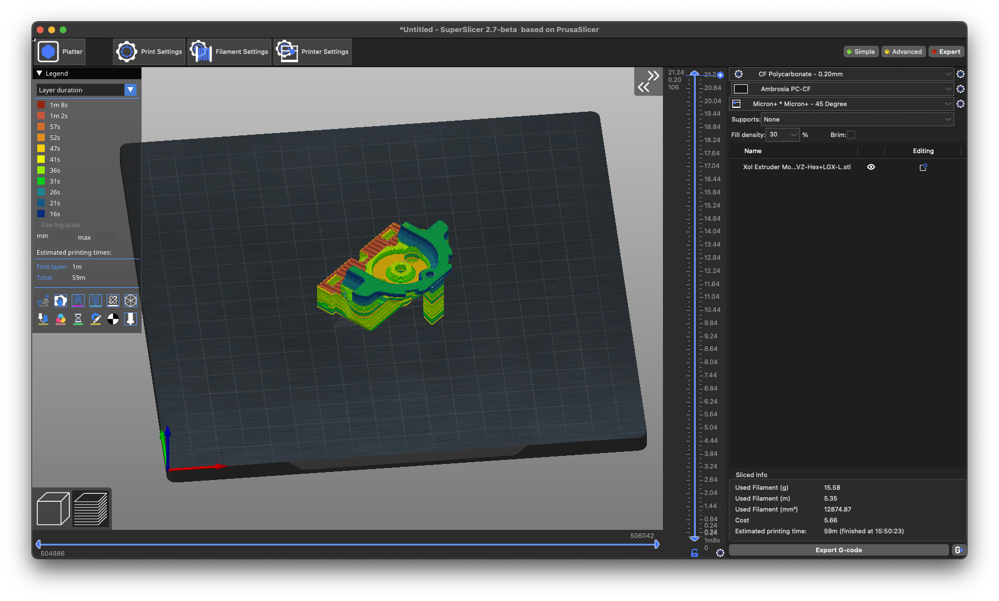

# SuperSlicer

SuperSlicer is an open-source slicing software designed for 3D printing enthusiasts who seek advanced control over their print settings. It is a fork of PrusaSlicer, which itself is based on Slic3r, and incorporates several powerful features and expanded functionalities that cater specifically to users requiring precise slicer controls and advanced pathing for 3D printing .

Head over to the [releases page](releases.md) to grab the latest version!

### What are SuperSlicer main features?

* Custom-made generated calibration tests.
* new settings to fine-tune the top surface quality, like 'only one perimeter on top'.
* A "denser infill" option for supporting the (solid) top layers.
* Better **Thin walls** (anchored inside the print, no more random bits at the ends, embedded in perimeter loops).
* Options to change holes dimensions and/or geometry, to print them at the right size.
* Better overhangs (add perimeters if needed, slice them in opposite direction each layer).
* Brim rework: many more options (inside, outside only, 'ears', per object)
* Some new seam options, to help hide them.
* Built-in calibration prints
* Built-in object generation script
* Can join perimeters into a big one to avoid travel moves.
* Many other little options and corrections (like the filled concentric pattern).
* It has also all the current slic3rPE/PrusaSlicer features.

### What are SuperSlicer / PrusaSlicer / Slic3r's main features?

Key features are:

* **Multi-platform** (Linux/Mac/Win) and packaged as standalone-app with no dependencies required
* Complete **command-line interface** to use it without GUI
* Multi-material **(multiple extruders)** object printing
* Multiple G-code flavors supported (RepRap, Makerbot, Mach3, Machinekit, etc.)
* Ability to plate **multiple objects having distinct print settings**
* **Multithread** processing
* **STL auto-repair** (tolerance for broken models)
* Wide automated unit testing

Other major features are:

* Combine infill every 'n' perimeters layer & varying density to speed up printing
* **3D preview** (including multi-material files)
* **Multiple layer heights** in a single print
* **Spiral vase** mode for bumpless vases
* Fine adjustment of speed, acceleration, and extrusion width
* Several infill patterns including honeycomb, spirals, Hilbert curves, gyroid
* Support material, raft, brim, skirt
* **Standby temperature** and automatic wiping for multi-extruder printing
* [Customizable **G-code macros**](https://github.com/prusa3d/PrusaSlicer/wiki/Slic3r-Prusa-Edition-Macro-Language) and output filename with variable placeholders
* Support for **post-processing scripts**
* **Cooling logic** controlling fan speed and dynamic print speed
