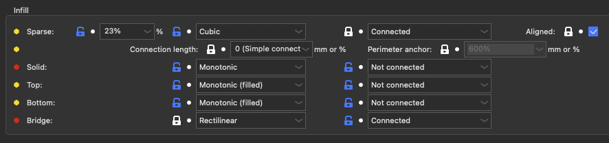
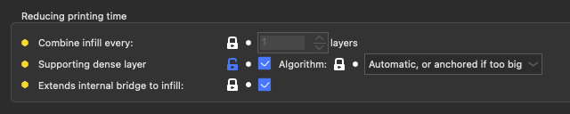
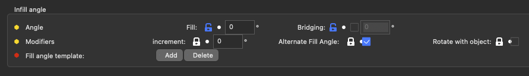
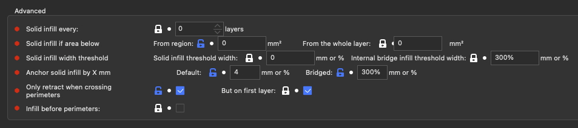
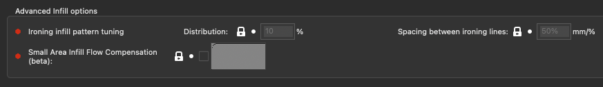
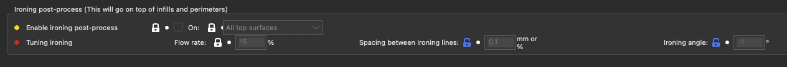

# Infill

## Infill

| Parameter                       | Parameter Name           | Parameter CLI flag         | Description                                                                                                                                                                                                                                                                                                                                                                                                                                                                                                                                                                                                                                                 | Default Value               |
| ------------------------------- | ------------------------ | -------------------------- | ----------------------------------------------------------------------------------------------------------------------------------------------------------------------------------------------------------------------------------------------------------------------------------------------------------------------------------------------------------------------------------------------------------------------------------------------------------------------------------------------------------------------------------------------------------------------------------------------------------------------------------------------------------- | --------------------------- |
| Sparse Infill %                 | fill_density             | --fill-density             | Density of internal infill, expressed in the range 0% - 100%. Set 0 to remove any sparse infill. Note that using a value of 100% won't change the type of infill from sparse to solid. If you want only solid infill, you can set the 'Solid infill every X layers' (solid_infill_every_layers) to 1 instead. (% )                                                                                                                                                                                                                                                                                                                                          | default: 18%                |
| Sparse Infill pattern           | fill_pattern             | --fill-pattern             | Fill pattern for general low-density infill. If you want an 'aligned' pattern, set 90° to the fill angle increment setting. (rectilinear, alignedrectilinear, monotonic, grid, triangles, stars, cubic, line, concentric, honeycomb, 3dhoneycomb, gyroid, hilbertcurve, archimedeanchords, octagramspiral, scatteredrectilinear, adaptivecubic, supportcubic, lightning)                                                                                                                                                                                                                                                                                    | default: stars              |
| Sparse Infill Connected         | infill_connection        | --infill-connection        | Give to the infill algorithm if the infill needs to be connected, and on which perimeters Can be useful for art or with high infill/perimeter overlap. The result may vary between infill types. (connected, holes, outershell, notconnected)                                                                                                                                                                                                                                                                                                                                                                                                               | default: connected          |
| Sparse Infill Connection Length | infill_anchor_max        | --infill-anchor-max        | Connect an infill line to an internal perimeter with a short segment of an additional perimeter. If expressed as percentage (example: 15%) it is calculated over infill extrusion width. Slic3r tries to connect two close infill lines to a short perimeter segment. If no such perimeter segment shorter than this parameter is found, the infill line is connected to a perimeter segment at just one side and the length of the perimeter segment taken is limited to infill_anchor, but no longer than this parameter. If set to 0, the old algorithm for infill connection will be used, it should create the same result as with 1000 & 0. (mm or %) | default: 0                  |
| Sparse Infill Perimeter anchor  | infill_anchor            | --infill-anchor            | Connect an infill line to an internal perimeter with a short segment of an additional perimeter. If expressed as percentage (example: 15%) it is calculated over infill extrusion width. Slic3r tries to connect two close infill lines to a short perimeter segment. If no such perimeter segment shorter than infill_anchor_max is found, the infill line is connected to a perimeter segment at just one side and the length of the perimeter segment taken is limited to this parameter, but no longer than anchor_length_max. Set this parameter to zero to disable anchoring perimeters connected to a single infill line. (mm or %)                  | default: 600%               |
| Solid Infill pattern            | solid_fill_pattern       | --solid-fill-pattern       | Fill pattern for solid (internal) infill. This only affects the solid not-visible layers. You should use rectilinear in most cases. You can try ironing for translucent material. Rectilinear (filled) replaces zig-zag patterns by a single big line & is more efficient for filling little spaces. If you want an 'aligned' pattern, set 90° to the fill angle increment setting. (rectilinear, rectilineargapfill, monotonic, monotonicgapfill, monotoniclines, alignedrectilinear, concentric, concentricgapfill, hilbertcurve, archimedeanchords, octagramspiral, smooth)                                                                              | default: rectilineargapfill |
| Solid Infill connection         | infill_connection_solid  | --infill-connection-solid  | Give to the infill algorithm if the infill needs to be connected, and on which perimeters Can be useful for art or with high infill/perimeter overlap. The result may vary between infill types. (connected, holes, outershell, notconnected)                                                                                                                                                                                                                                                                                                                                                                                                               | default: connected          |
| Top Infill pattern              | top_fill_pattern         | --top-fill-pattern         | Fill pattern for top infill. This only affects the top visible layer, and not its adjacent solid shells. If you want an 'aligned' pattern, set 90° to the fill angle increment setting. (rectilinear, monotonic, monotonicgapfill, monotoniclines, alignedrectilinear, concentric, concentricgapfill, hilbertcurve, archimedeanchords, octagramspiral, sawtooth, smooth)                                                                                                                                                                                                                                                                                    | default: monotonic          |
| Top Infill connection           | infill_connection_top    | --infill-connection-top    | -Give to the infill algorithm if the infill needs to be connected, and on which perimeters Can be useful for art or with high infill/perimeter overlap. The result may vary between infill types. (connected, holes, outershell, notconnected)                                                                                                                                                                                                                                                                                                                                                                                                              | default: connected          |
| Bottom Infill pattern           | bottom_fill_pattern      | --bottom-fill-pattern      | Fill pattern for bottom infill. This only affects the bottom visible layer, and not its adjacent solid shells. If you want an 'aligned' pattern, set 90° to the fill angle increment setting. (rectilinear, monotonic, monotonicgapfill, monotoniclines, alignedrectilinear, concentric, concentricgapfill, hilbertcurve, archimedeanchords, octagramspiral, smooth)                                                                                                                                                                                                                                                                                        | default: monotonic          |
| Bottom Infill connection        | infill_connection_bottom | --infill-connection-bottom | Give to the infill algorithm if the infill needs to be connected, and on which perimeters Can be useful for art or with high infill/perimeter overlap. The result may vary between infill types. (connected, holes, outershell, notconnected)                                                                                                                                                                                                                                                                                                                                                                                                               | default: connected          |
| Bridge Infill Pattern           | bridge_fill_pattern      | --bridge-fill-pattern      | Fill pattern for bridges and internal bridge infill. (rectilinear, monotonic)                                                                                                                                                                                                                                                                                                                                                                                                                                                                                                                                                                               | default: rectilinear        |
| Bridge Infill connection        | infill_connection_bridge | --infill-connection-bridge | Give to the bridge infill algorithm if the infill needs to be connected, and on which perimeters. Can be useful to disconnect to reduce a little bit the pressure buildup when going over the bridge's anchors. (connected, holes, outershell, notconnected)                                                                                                                                                                                                                                                                                                                                                                                                | default: notconnected       |

## Reducing printing time

| Parameter                         | Parameter Name            | Parameter CLI flag          | Description                                                                                                                                                                                                                                                                                                                             | Default Value         |
| --------------------------------- | ------------------------- | --------------------------- | --------------------------------------------------------------------------------------------------------------------------------------------------------------------------------------------------------------------------------------------------------------------------------------------------------------------------------------- | --------------------- |
| Combine infill every              | infill_every_layers       | --infill-every-layers       | This feature allows you to combine infill and speed up your print by extruding thicker infill layers while preserving thin perimeters, thus accuracy. (layers)                                                                                                                                                                          | default: 1            |
| Supporting dense layer            | infill_dense              | --infill-dense              | Enables the creation of a support layer under the first solid layer. This allowsyou to use a lower infill ratio without compromising the top quality. The dense infill is laid out with a 50% infill density.                                                                                                                           | default: false        |
| Supporting dense layer algorithm  | infill_dense_algo         | --infill-dense-algo         | Choose the way the dense layer is laid out. The automatic option lets it try to draw the smallest surface with only strait lines inside the sparse infill. The Anchored option just slightly enlarges (by 'Default infill margin') the surfaces that need a better support. (automatic, autonotfull, autosmall, autoenlarged, enlarged) | default: autoenlarged |
| Extends internal bridge to infill | internal_bridge_expansion | --internal-bridge-expansion | When creating internal bridges, extends the line to the nearest internal line it can use to support itself. This way, it can avoid curling up as when bridges lines ends over a void.                                                                                                                                                   | default: true         |

## Infill angle

| Parameter                          | Parameter Name          | Parameter CLI flag        | Description                                                                                                                                                                                                                                                                                                                                                                                                                                 | Default Value  |
| ---------------------------------- | ----------------------- | ------------------------- | ------------------------------------------------------------------------------------------------------------------------------------------------------------------------------------------------------------------------------------------------------------------------------------------------------------------------------------------------------------------------------------------------------------------------------------------- | -------------- |
| Angle - Fill                       | fill_angle              | --fill-angle              | Default base angle for infill orientation. Cross-hatching will be applied to this. Bridges will be infilled using the best direction Slic3r can detect, so this setting does not affect them. (°)                                                                                                                                                                                                                                           | default: 45    |
| Angle - Bridging                   | bridge_angle            | --bridge-angle            | Bridging angle override. If disabled, the bridging angle will be calculated automatically. Otherwise the provided angle will be used for all bridges.Note: 180° is the same as zero angle. (°)                                                                                                                                                                                                                                              | default: 0     |
| Modifiers - Increment              | fill_angle_increment    | --fill-angle-increment    | Add this angle each layer to the base angle for infill. May be useful for art, or to be sure to hit every object's feature even with very low infill. Still experimental, tell me what makes it useful, or the problems that arise using it. (°)                                                                                                                                                                                            | default: 0     |
| Modifiers - Alternative Fill Angle | --fill-angle-cross      | --fill-angle-cross        | It's better for some infill like rectilinear to rotate 90° each layer. If this setting is deactivated, they won't do that anymore.                                                                                                                                                                                                                                                                                                          | default: true  |
| Modifiers - Rotate with object     | fill_angle_follow_model | --fill-angle-follow-model | If your object has a z-rotation, then the infill will also be rotated by this value.                                                                                                                                                                                                                                                                                                                                                        | default: false |
| Fill angle template                | fill_angle_template     | --fill-angle-template     | This define the succetion of infill angle. When defined, it replaces the fill_angle, and there won't be any extra 90° for each layer added, but the fill_angle_increment will still be used. The first layer start with the first angle. If a new pattern is used in a modifier, it will choose the layer angle from the pattern as if it has started from the first layer.Empty this settings to disable and recover the old behavior. (°) | default: null  |

## Advanced

| Parameter                                                   | Parameter Name                        | Parameter CLI flag                      | Description                                                                                                                                                                                                                                                                           | Default Value  |
| ----------------------------------------------------------- | ------------------------------------- | --------------------------------------- | ------------------------------------------------------------------------------------------------------------------------------------------------------------------------------------------------------------------------------------------------------------------------------------- | -------------- |
| Solid infill every                                          | solid_infill_every_layers             | --solid-infill-every-layers             | This feature allows to force a solid layer every given number of layers. Zero to disable. You can set this to any value (for example 9999); Slic3r will automatically choose the maximum possible number of layers to combine according to nozzle diameter and layer height. (layers) | default: 0     |
| Solid infill if area below - From region                    | solid_infill_below_area               | --solid-infill-below-area               | Force solid infill for regions having a smaller area than the specified threshold. (mm²)                                                                                                                                                                                              | default: 4     |
| Solid infill if area below - From the whole layer           | solid_infill_below_layer_area         | --solid-infill-below-layer-area         | Force solid infill for the whole layer when the combined area of all objects that are printed at the same layer is smaller than this value. (mm²)                                                                                                                                     | default: 0     |
| Solid infill width threshold - Solid infill threshold width | solid_infill_below_width              | --solid-infill-below-width              | Force solid infill for parts of regions having a smaller width than the specified threshold. Can be a % of the current solid infill spacing. Set 0 to disable. (mm or %)                                                                                                              | default: 0     |
| Internal Bridge Infill threshold width                      | internal_bridge_min_width             | --internal-bridge-min-width             | Minimum width for the solid infill to convert into an internal bridge infill. Can be a % of the current solid infill spacing. (mm or %)                                                                                                                                               | default: 300%  |
| Anchor solid infill by X mm - Default                       | external_infill_margin                | --external-infill-margin                | This parameter grows the top/bottom/solid layers by the specified mm to anchor them into the sparse infill and support the perimeters above. Put 0 to deactivate it. Can be a % of the width of the perimeters. (mm or %)                                                             | default: 150%  |
| Anchor solid infill by X mm - Bridged                       | bridged_infill_margin                 | --bridged-infill-margin                 | This parameter grows the bridged solid infill layers by the specified mm to anchor them into the sparse infill and over the perimeters below. Put 0 to deactivate it. Can be a % of the width of the external perimeter. (mm or %)                                                    | default: 200%  |
| Only retract when crossing perimeters                       | only_retract_when_crossing_perimeters | --only-retract-when-crossing-perimeters | Disables retraction when the travel path does not exceed the upper layer's perimeters (and thus any ooze will probably be invisible).                                                                                                                                                 | default: false |
| Only retract when crossing perimeters - But on first layer  | enforce_retract_first_layer           | --enforce-retract-first-layer           | Let the retraction happens on the first layer even if the travel path does not exceed the upper layer's perimeters.                                                                                                                                                                   | default: true  |
| Infill before perimeters                                    | infill_first                          | --infill-first                          | This option will switch the print order of perimeters and infill, making the latter first.                                                                                                                                                                                            | default: false |

## Advanced Infill options

| Parameter                                 | Parameter Name                              | Parameter CLI flag                          | Description                                                                                                                                                                                                                                                                                                                                                                                                                                                                                                                                                         | Default Value                                                                                                                          |
| ----------------------------------------- | ------------------------------------------- | ------------------------------------------- | ------------------------------------------------------------------------------------------------------------------------------------------------------------------------------------------------------------------------------------------------------------------------------------------------------------------------------------------------------------------------------------------------------------------------------------------------------------------------------------------------------------------------------------------------------------------- | -------------------------------------------------------------------------------------------------------------------------------------- |
| Ironing infill pattern tuning             | fill_smooth_distribution                    | --fill-smooth-distribution                  | This is the percentage of the flow that is used for the second ironing pass. Typical 10-20%. Should not be higher than 20%, unless you have your top extrusion width greatly superior to your nozzle width. A value too low and your extruder will eat the filament. A value too high and the first pass won't print well. (%)                                                                                                                                                                                                                                      | default: 10%                                                                                                                           |
| Small Area infill Flow Compensation(beta) | --small-area-infill-flow-compensation-model | --small-area-infill-flow-compensation-model | Flow Compensation Model, used to adjust the flow for small solid infill lines. The model is a graph of flow correction factors (between 0 and 1) per extrusion length (in mm). The first point length has to be 0mm. the last point need to have a flow correction of 1. It's always disabled on the first layer, to not compromise adhesion.  Reduces the flow when a strait extrusion in a solid infill area (not first layer) is short (this is done after the 'ensure 100% fill volume'). 'short' is defined in the graph, as well as the flow reduction. | default: !0: 10:2: 0x0: 0.2x0.44: 0.4x0.61: 0.6x0.7: 0.8x0.76: 1.5x0.86: 2x0.89: 3x0.92: 5x0.95: 10x1 |

## Ironing post-process

| Parameter                                      | Parameter Name   | Parameter CLI flag | Description                                                                                                                                                                     | Default Value  |
| ---------------------------------------------- | ---------------- | ------------------ | ------------------------------------------------------------------------------------------------------------------------------------------------------------------------------- | -------------- |
| Enable ironing post-process                    | ironing          | --ironing          | Enable ironing of the top layers with the hot print head for smooth surface                                                                                                     | default: false |
| Enable ironing post-process On                 | ironing_type     | --ironing-type     | Ironing Type (top, topmost, solid)                                                                                                                                              | default: top   |
| Tuning ironing - Flow rate                     | ironing_flowrate | --ironing-flowrate | Percent of a flow rate relative to object's normal layer height. It's the percentage of the layer that will be over-extruded on top to do the ironing. (%)                      | default: 15%   |
| Tuning ironing - Spacing between ironing lines | ironing_spacing  | --ironing-spacing  | Distance between ironing lines. Can be a % of the nozzle diameter used for ironing. (mm or %)                                                                                   | default: 25%   |
| Tuning ironing - Ironing angle                 | ironing_angle    | --ironing-angle    | Ironing post-process angle. If positive, the ironing will use this angle. If -1, it will use the fill angle. If lower than -1, it will use the fill angle minus this angle. (°) | default: -45   |
