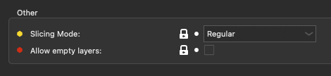

# Output options

## Platter

| Parameter                        | Parameter Name     | Parameter CLI flag   | Description                                                                                                     | Default Value |
| -------------------------------- | ------------------ | -------------------- | --------------------------------------------------------------------------------------------------------------- | ------------- |
| Default distance between objects | duplicate_distance | --duplicate-distance | Default distance used for the auto-arrange feature of the platter. Set to 0 to use the last value instead. (mm) | default: "6"  |

## Sequential printing

| Parameter                   | Parameter Name | Parameter CLI flag | Description                                                                                  | Default Value |
| --------------------------- | -------------- | ------------------ | -------------------------------------------------------------------------------------------- | ------------- |
| Complete individual objects | notes          | --notes            | Here you can put your personal notes. This text will be added to the G-code header comments. | default: ""   |
| Parallel printing step      |                |                    |                                                                                              |               |
| Allow only one skirt loop   |                |                    |                                                                                              |               |
| Object sort                 |                |                    |                                                                                              |               |
| Extruder clearance (mm)     |                |                    |                                                                                              |               |

## Output file

| Parameter              | Parameter Name | Parameter CLI flag | Description                                                                                  | Default Value |
| ---------------------- | -------------- | ------------------ | -------------------------------------------------------------------------------------------- | ------------- |
| Verbose G-code         | notes          | --notes            | Here you can put your personal notes. This text will be added to the G-code header comments. | default: ""   |
| Label objects          |                |                    |                                                                                              |               |
| Output filename format |                |                    |                                                                                              |               |

## Other

| Parameter                                                          | Parameter Name | Parameter CLI flag | Description                                                                                  | Default Value |
| ------------------------------------------------------------------ | -------------- | ------------------ | -------------------------------------------------------------------------------------------- | ------------- |
| [G-code substitutions](/advanced-usage-guides/gcode-substitutions) | notes          | --notes            | Here you can put your personal notes. This text will be added to the G-code header comments. | default: ""   |

## Post-processing script

| Parameter               | Parameter Name | Parameter CLI flag | Description                                                                                  | Default Value |
| ----------------------- | -------------- | ------------------ | -------------------------------------------------------------------------------------------- | ------------- |
| Post-processing scripts | notes          | --notes            | Here you can put your personal notes. This text will be added to the G-code header comments. | default: ""   |

## Post-process milling

| Parameter               | Parameter Name | Parameter CLI flag | Description                                                                                  | Default Value    |
| ----------------------- | -------------- | ------------------ | -------------------------------------------------------------------------------------------- | ---------------- |
| Milling post-processing | notes          | --notes            | Here you can put your personal notes. This text will be added to the G-code header comments. | default: "false" |
| Milling extra XY size   |                |                    |                                                                                              |                  |
| Milling only after      |                |                    |                                                                                              |                  |
| Milling Speed           |                |                    |                                                                                              |                  |
