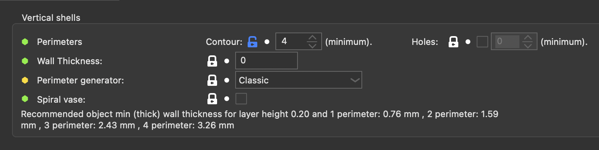
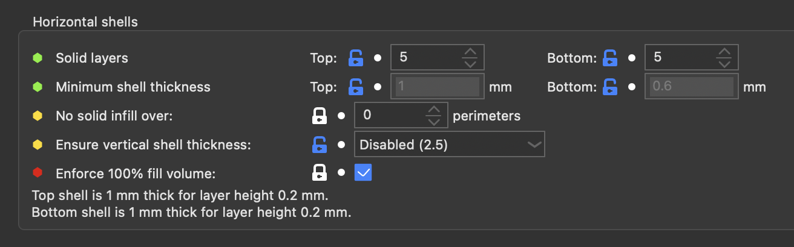
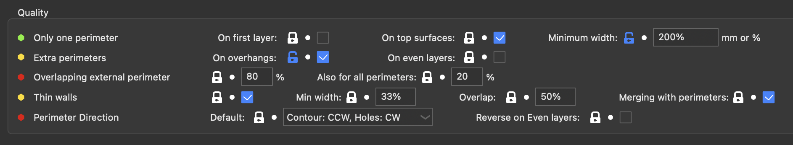
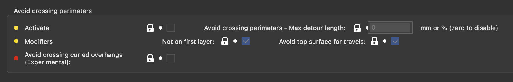
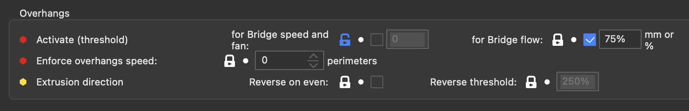
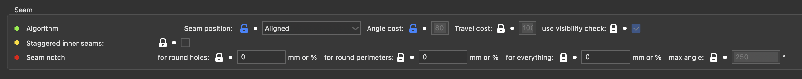
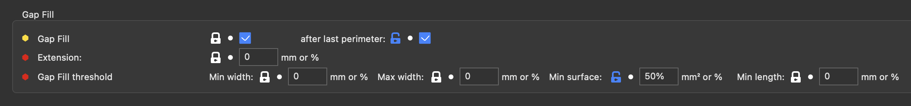
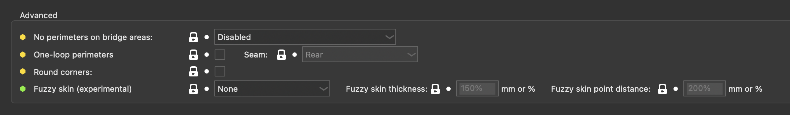
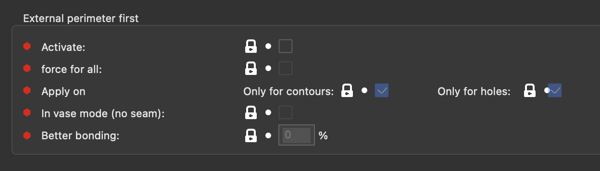
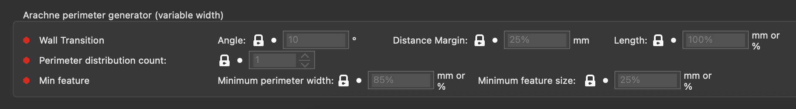

# Perimiters and Shells

## Vertical Shells

| Parameter            | Parameter Name      | Parameter CLI Flag    | Description                                                                                                                                                                                                                                                                                                                                                                                                                                                                                                                                                            | Default Value    |
| -------------------- | ------------------- | --------------------- | ---------------------------------------------------------------------------------------------------------------------------------------------------------------------------------------------------------------------------------------------------------------------------------------------------------------------------------------------------------------------------------------------------------------------------------------------------------------------------------------------------------------------------------------------------------------------- | ---------------- |
| Perimiters - Contour | perimeters          | --perimeters          | This option sets the number of perimeters to generate for each layer. If perimeters_hole is activated, then this number is only for contour perimeters. Note that if a contour perimeter encounter a hole, it will go around like a hole perimeter. Note that SuperSlicer may increase this number automatically when it detects sloping surfaces which benefit from a higher number of perimeters if the Extra Perimeters option is enabled.                                                                                                                          | default: 3       |
| Perimiters - Holes   | perimeters_hole     | --perimeters-hole     | This option sets the number of perimeters to have over holes. Note that if a hole-perimeter fuse with the contour, then it will go around like a contour perimeter. If disabled, holes will have the same number of perimeters as contour. Cannot be enabled at the same time as Arachne generator. Note that SuperSlicer may increase this number automatically when it detects sloping surfaces which benefit from a higher number of perimeters if the Extra Perimeters option is enabled.                                                                          | default: !0      |
| Wall Thickness       | s_wall_thickness    |                       | Changes the perimeter extrusion widths to ensure there is an exact number of perimeters for this wall thickness value. It won't put the perimeter width below the nozzle diameter, and up to double. Note that the value displayed is just a view of the current perimeter thickness, like the info text below. The number of perimeters to compute this value is one loop, or the custom variable 'wall_thickness_lines' (advanced mode) if defined.  If the value is too low, it will revert the widths to the saved value. If the value is 0, it will show 0. | default: 0       |
| Perimeter Generator: | perimeter_generator | --perimeter-generator | Classic perimeter generator produces perimeters with constant extrusion width and for very thin areas is used gap-fill. Arachne engine produces perimeters with variable extrusion width. This setting also affects the Concentric infill. (classic, arachne)                                                                                                                                                                                                                                                                                                          | default: classic |
| Spiral vase:         | spiral_vase         | --spiral-vase         | This feature will raise Z gradually while printing a single-walled object in order to remove any visible seam. This option requires no infill, no top solid layers and no support material. You can still set any number of bottom solid layers as well as skirt/brim loops. After the bottom solid layers, the number of perimeters is enforce to 1.It won't work when printing more than one single object.                                                                                                                                                          | default: false   |

## Horizontal Shells

| Parameter                         | Parameter Name                  | Parameter CLI Flag                | Description                                                                                                                                                                                                                                                                                                                                                                                                                                                                                                                                                                                                                                                                                                                                                           | Default Value        |
| --------------------------------- | ------------------------------- | --------------------------------- | --------------------------------------------------------------------------------------------------------------------------------------------------------------------------------------------------------------------------------------------------------------------------------------------------------------------------------------------------------------------------------------------------------------------------------------------------------------------------------------------------------------------------------------------------------------------------------------------------------------------------------------------------------------------------------------------------------------------------------------------------------------------- | -------------------- |
| Solid Layers - Top                | top_solid_layers                | --top-solid-layers                | Number of solid layers to generate on top surfaces.                                                                                                                                                                                                                                                                                                                                                                                                                                                                                                                                                                                                                                                                                                                   | default: 3           |
| Solid Layers - Bottom             | bottom_solid_layers             | --bottom-solid-layers             | Number of solid layers to generate on bottom surfaces.                                                                                                                                                                                                                                                                                                                                                                                                                                                                                                                                                                                                                                                                                                                | default: 3           |
| Minimum shell  thickness - Top    | top_solid_min_thickness         | --top-solid-min-thickness         | The number of top solid layers is increased above top_solid_layers if necessary to satisfy minimum thickness of top shell. This is useful to prevent pillowing effect when printing with variable layer height. (mm)                                                                                                                                                                                                                                                                                                                                                                                                                                                                                                                                            | default: 0           |
| Minimum shell  thickness - Bottom | bottom_solid_min_thickness      | --bottom-solid-min-thickness      | The number of bottom solid layers is increased above bottom_solid_layers if necessary to satisfy minimum thickness of bottom shell. (mm)                                                                                                                                                                                                                                                                                                                                                                                                                                                                                                                                                                                                                              | default: 0           |
| No solid infill over - Perimiters | solid_over_perimeters           | --solid-over-perimeters           | In sloping areas, when you have a number of top / bottom solid layers and few perimeters, it may be necessary to put some solid infill above/below the perimeters to fulfill the top/bottom layers criteria. By setting this to something higher than 0, you can control this behaviour, which might be desirable if undesirable solid infill is being generated on slopes. The number set here indicates the number of layers between the inside of the part and the air at and beyond which solid infill should no longer be added above/below. If this setting is equal or higher than the top/bottom solid layer count, it won't do anything. If this setting is set to 1, it will evict all solid fill above/below perimeters. Set zero to disable. (perimeters) | default: 0           |
| Ensure vertical shell thickness   | ensure_vertical_shell_thickness | --ensure-vertical-shell-thickness | Add solid infill near sloping surfaces to guarantee the vertical shell thickness (top+bottom solid layers). (disabled, partial, enabled, enabled_old)                                                                                                                                                                                                                                                                                                                                                                                                                                                                                                                                                                                                              | default: enabled_old |
| Enforce 100% fill volume          | enforce_full_fill_volume        | --enforce-full-fill-volume        | Experimental option which modifies (in solid infill) fill flow to have the exact amount of plastic inside the volume to fill (it generally changes the flow from -7% to +4%, depending on the size of the surface to fill and the overlap  parameters, but it can go as high as +50% for infill in very small areas where rectilinear doesn't have good coverage). It has the advantage to remove the over-extrusion seen in thin infill areas, from the overlap ratio                                                                                                                                                                                                                                                                                                | default: true        |

## Quality

| Parameter                                    | Parameter Name                 | Parameter CLI Flag               | Description                                                                                                                                                                                                                                                                                                                                                                                                                                                                                                                | Default Value    |
| -------------------------------------------- | ------------------------------ | -------------------------------- | -------------------------------------------------------------------------------------------------------------------------------------------------------------------------------------------------------------------------------------------------------------------------------------------------------------------------------------------------------------------------------------------------------------------------------------------------------------------------------------------------------------------------- | ---------------- |
| Only one perimeter (On first layer)          | only_one_perimeter_first_layer | --only-one-perimeter-first-layer | Use only one perimeter on first layer, to give more space to the top infill pattern.                                                                                                                                                                                                                                                                                                                                                                                                                                       | default: false   |
| Only one perimeter (On top surfaces)         | only_one_perimeter_top         | --only-one-perimeter-top         | Use only one perimeter on flat top surface, to give more space to the top infill pattern.                                                                                                                                                                                                                                                                                                                                                                                                                                  | default: true    |
| Only one perimeter (Minimum width)           | min_width_top_surface          | --min-width-top-surface          | If a top surface has to be printed and it's partially covered by another layer, it won't be considered at a top layer where its width is below this value. This can be useful to not let the 'one perimeter on top' trigger on surface that should be covered only by perimeters. This value can be a mm or a % of the perimeter extrusion width. Warning: If enabled, artifacts can be created is you have some thin features on the next layer, like letters. Set this setting to 0 to remove these artifacts. (mm or %) | default: 100%    |
| Extra perimeters (On overhangs)              | extra_perimeters_on_overhangs  | --extra-perimeters-on-overhangs  | Detect overhang areas where bridges cannot be anchored, and fill them with extra perimeter paths. These paths are anchored to the nearby non-overhang area when possible. If you use this setting, strongly consider also using overhangs_reverse.                                                                                                                                                                                                                                                                         | default: false   |
| Extra perimeters (On even layers)            | extra_perimeters_odd_layers    | --extra-perimeters-odd-layers    | Add one perimeter every even layer (and not on odd layers like the first one). With this, infill is taken into the sandwich and you may be able to reduce drastically the infill/perimeter overlap setting.                                                                                                                                                                                                                                                                                                                | default: 0       |
| Overlapping external perimeter ()            | thin_perimeters                | --thin-perimeters                | Allow outermost perimeter to overlap itself to avoid the use of thin walls. Note that flow isn't adjusted and so this will result in over-extruding and undefined behavior. 100% means that perimeters can overlap completly on top of each other. 0% will deactivate this setting. Values below 2% don't have any effect. -1% will also deactivate the anti-hysteris checks for external perimeters. (%)                                                                                                                  | default: 80%     |
| Also for all perimiters                      | thin_perimeters_all            | --thin-perimeters-all            | Allow all perimeters to overlap, instead of just external ones. 100% means that perimeters can overlap completly on top of each other. 0% will deactivate this setting. Values below 2% don't have any effect. -1% will also deactivate the anti-hysteris checks for internal perimeters. (%)                                                                                                                                                                                                                              | default: true    |
| Thin Walls                                   | thin_walls                     | --thin-walls                     | Detect single-width walls (parts where two extrusions don't fit and we need to collapse them into a single trace). If unchecked, Slic3r may try to fit perimeters where it's not possible, creating some overlap leading to over-extrusion.                                                                                                                                                                                                                                                                                | default: true    |
| Thin Walls (Min width)                       | thin_walls_min_width           | --thin-walls-min-width           | Minimum width for the extrusion to be extruded (widths lower than the nozzle diameter will be over-extruded at the nozzle diameter). If expressed as percentage (for example 110%) it will be computed over nozzle diameter. The default behavior of PrusaSlicer is with a 33% value. Put 100% to avoid any sort of over-extrusion.                                                                                                                                                                                     | (default: 33%)   |
| Thin Walls (Overlap)                         | thin_walls_overlap             | --thin-walls-overlap             | Overlap between the thin wall and the perimeters. Can be a % of the external perimeter width (default 50%)                                                                                                                                                                                                                                                                                                                                                                                                                 | (default: 50%)   |
| Thin Walls (Merging with perimeters)         | thin_walls_merge               | --thin-walls-merge               | Allow the external perimeter to merge the thin walls in the path. You can  deactivate this if you are using thin walls as a custom support, to reduce adhesion a little.                                                                                                                                                                                                                                                                                                                                                   | default: true    |
| Perimeter Direction (Default)                | perimeter_direction            | --perimeter-direction            | Default direction to print the perimeters (contours and holes): clockwise (CW) or counter-clockwise (CCW). (ccw_cw, ccw_ccw, cw_ccw, cw_cw)                                                                                                                                                                                                                                                                                                                                                                                | default: ccw_cw0 |
| Perimeter Direction (Reverse on even layers) | perimeter_reverse              | --perimeter-reverse              | On even layers, all perimeter loops are reversed (it disables the overhang reversal, so it doesn't double-reverse).That setting will likely create defects on the perimeters, so it's only useful is for materials that have some direction-dependent properties (stress lines).                                                                                                                                                                                                                                           | default: false   |

## Avoid Crossing Perimeters

| Parameter                                      | Parameter Name                       | Parameter CLI Flag                     | Description                                                                                                                                                                                                                                                                                                         | Default Value  |
| ---------------------------------------------- | ------------------------------------ | -------------------------------------- | ------------------------------------------------------------------------------------------------------------------------------------------------------------------------------------------------------------------------------------------------------------------------------------------------------------------- | -------------- |
| Activate                                       | avoid_crossing_perimeters            | --avoid-crossing-perimeters            | Optimize travel moves in order to minimize the crossing of perimeters. This is mostly useful with Bowden extruders which suffer from oozing. This feature slows down both the print and the G-code generation.                                                                                                      | default: false |
| Avoid crossing perimeters - Max detour length  | avoid_crossing_perimeters_max_detour | --avoid-crossing-perimeters-max-detour | The maximum detour length for avoid crossing perimeters. If the detour is longer than this value, avoid crossing perimeters is not applied for this travel path. Detour length can be specified either as an absolute value or as percentage (for example 50%) of a direct travel path. (mm or %) (zero to disable) | default: 0     |
| Modifiers (Not on first layer)                 | avoid_crossing_not_first_layer       | --avoid-crossing-not-first-layer       | Disable 'Avoid crossing perimeters' for the first layer.                                                                                                                                                                                                                                                            | default: true  |
| Modifiers (Avoid top surface for travels)      | avoid_crossing_top                   | --avoid-crossing-top                   | When using 'Avoid crossing perimeters', consider the top surfaces as a void, to avoid travelling over them if possible.                                                                                                                                                                                             | default: true  |
| Avoid crossing curled overhangs (experimental) | avoid_crossing_curled_overhangs      | --avoid-crossing-curled-overhangs      | Plan travel moves such that the extruder avoids areas where the filament may be curled up. This is mostly happening on steeper rounded overhangs and may cause a crash with the nozzle. This feature slows down both the print and the G-code generation.                                                           | default: false |

## Overhangs

| Parameter                                     | Parameter Name              | Parameter CLI Flag            | Description                                                                                                                                                                                                                                                                                                                                                                                                      | Default Value  |
| --------------------------------------------- | --------------------------- | ----------------------------- | ---------------------------------------------------------------------------------------------------------------------------------------------------------------------------------------------------------------------------------------------------------------------------------------------------------------------------------------------------------------------------------------------------------------- | -------------- |
| Activate (threshold) for Bridge speed and fan | overhangs_width_speed       | --overhangs-width-speed       | Minimum unsupported width for an extrusion to apply the bridge fan & overhang speed to it. Can be in mm or in a % of the nozzle diameter. Can be overriden by the overhang flow threshold if its value lower than this threshold. If dynamic speed is used, then the dynamic speed will be computed between 0% and this threshold. (mm or %)                                                                     | default: 55%   |
| Activate (threshold) for Bridge flow          | overhangs_width             | --overhangs-width             | Minimum unsupported width for an extrusion to apply the overhang bridge flow to it. Can be in mm or in a % of the nozzle diameter. If lower than the threshold for overhangs speed, then this threshold is used for both. If dynamic speed is used, and the overhangs speed threshold isn't enabled or is higher than this one, then the dynamic speed will be computed between 0% and this threshold. (mm or %) | default: 75%   |
| Enforce overhangs speed                       | overhangs_speed_enforce     | --overhangs-speed-enforce     | Set the speed of the full perimeters to the overhang speed, and also the next one(s) if any. Set to 0 to disable. Set to 1 to set the overhang speed to the full perimeter if there is any overhang detected inside it. Set to more than 1 to also set the overhang speed to the next perimeter(s) (only in classic mode). (perimeters)                                                                          | default: 0     |
| Extrusion direction - Reverse on even         | overhangs_reverse           | --overhangs-reverse           | Extrude perimeters that have an overhanging part in the reverse direction on even layers (not on odd layers like the first one). This alternating pattern can significantly improve steep overhangs. !! this is a very slow algorithm !!                                                                                                                                                                         | default: false |
| Extrusion direction - Reverse threshold       | overhangs_reverse_threshold | --overhangs-reverse-threshold | Number of mm the overhang need to be for the reversal to be considered useful. Can be a % of the perimeter width. (%)                                                                                                                                                                                                                                                                                            | default: 250%  |

## Seam

| Parameter                         | Parameter Name        | Parameter CLI Flag      | Description                                                                                                                                                                                                                                                                                                                                                                                                                                                                                                                                                                                                                                                                                                                                                                                                          | Default Value  |
| --------------------------------- | --------------------- | ----------------------- | -------------------------------------------------------------------------------------------------------------------------------------------------------------------------------------------------------------------------------------------------------------------------------------------------------------------------------------------------------------------------------------------------------------------------------------------------------------------------------------------------------------------------------------------------------------------------------------------------------------------------------------------------------------------------------------------------------------------------------------------------------------------------------------------------------------------- | -------------- |
| Seam position                     | seam_position         | --seam-position         | Position of perimeters' starting points. Cost-based option let you choose the angle and travel cost. A high angle cost will place the seam where it can be hidden by a corner, the travel cost place the seam near the last position (often at the end of the previous infill). Default is 60 % and 100 %. There is also the visibility and the overhang cost, but they are static. Scattered: seam is placed at a random position on external perimeters Random: seam is placed at a random position for all perimeters Aligned: seams are grouped in the best place possible (minimum 6 layers per group) Contiguous: seam is placed over a seam from the previous layer (useful with enforcers) Rear: seam is placed at the far side (highest Y coordinates) (cost, random, allrandom, aligned, contiguous, rear) | default: cost  |
| Angle cost                        | seam_angle_cost       | --seam-angle-cost       | Cost of placing the seam at a bad angle. The worst angle (max penalty) is when it's flat. 100% is the default penalty (%)                                                                                                                                                                                                                                                                                                                                                                                                                                                                                                                                                                                                                                                                                            | default: 60%   |
| Travel cost                       | seam_travel_cost      | --seam-travel-cost      | Cost of moving the extruder. The highest penalty is when the point is the furthest from the position of the extruder before extruding the external perimeter (%)                                                                                                                                                                                                                                                                                                                                                                                                                                                                                                                                                                                                                                                     | default: 100%  |
| use visibility check              | seam_visibility       | --seam-visibility       | Check and penalize seams that are the most visible. launch rays to check from how many direction a point is visible. This is a compute-intensive option.                                                                                                                                                                                                                                                                                                                                                                                                                                                                                                                                                                                                                                                             | default: true  |
| Staggered inner seams             | staggered_inner_seams | --staggered-inner-seams | This option causes the inner seams to be shifted backwards based on their depth, forming a zigzag pattern.                                                                                                                                                                                                                                                                                                                                                                                                                                                                                                                                                                                                                                                                                                           | default: false |
| Seam notch - for round holes      | seam_notch_inner      | --seam-notch-inner      | In convex holes (circular/oval), it's sometimes very problematic to have a little buldge from the seam. This setting move the seam inside the part, in a little cavity (for all external perimeters in convex holes, unless it's in an overhang). The size of the cavity is in mm or a % of the external perimeter width Set zero to disable. (mm or %)                                                                                                                                                                                                                                                                                                                                                                                                                                                              | default: 0     |
| Seam notch - for round perimeters | seam_notch_outer      | --seam-notch-outer      | In convex perimeters (circular/oval), it's sometimes very problematic to have a little buldge from the seam. This setting move the seam inside the part, in a little cavity (for all external perimeters if the path is convex, unless it's in an overhang). The size of the cavity is in mm or a % of the external perimeter width Set zero to disable. (mm or %)                                                                                                                                                                                                                                                                                                                                                                                                                                                   | default: 0     |
| Seam notch - for everything       | seam_notch_all        | --seam-notch-all        | It's sometimes very problematic to have a little buldge from the seam. This setting move the seam inside the part, in a little cavity (for every seams in external perimeters, unless it's in an overhang). The size of the cavity is in mm or a % of the external perimeter width. It's overriden by the two other 'seam notch' setting when applicable. Set zero to disable. (mm or %)                                                                                                                                                                                                                                                                                                                                                                                                                          | default: 0     |
| Seam notch - max angle            | seam_notch_angle      | --seam-notch-angle      | If the (external) angle at the seam is higher than this value, then no notch will be set. If the angle is too high, there isn't enough room for the notch. Can't be lower than 180° or it filters everything. At 360, it allows everything. (°)                                                                                                                                                                                                                                                                                                                                                                                                                                                                                                                                                                      | default: 250   |

## Gap Fill

| Parameter                         | Parameter Name      | Parameter CLI Flag    | Description                                                                                                                                                                                          | Default Value  |
| --------------------------------- | ------------------- | --------------------- | ---------------------------------------------------------------------------------------------------------------------------------------------------------------------------------------------------- | -------------- |
| Gap FIll                          | gap_fill_enabled    | --gap-fill-enabled    | Enable gap fill algorithm. It will extrude small lines between perimeters when there is not enough space for another perimeter or an infill.                                                         | default: true  |
| Gap Fill - after last perimeter   | gap_fill_last       | --gap-fill-last       | All gaps, between the last perimeter and the infill, which are thinner than a perimeter will be filled by gap fill.                                                                                  | default: false |
| Extension                         | gap_fill_extension  | --gap-fill-extension  | Increase the length of all gap fills by this amount (may over extrude a little bit) Can be a % of the extrusion width Is also used by infill's gap fill. (mm or %)                                   | default: 0     |
| Gap Fill threashold - Min width   | gap_fill_min_width  | --gap-fill-min-width  | This setting represents the minimum width of a gapfill. Points thinner than this threshold won't be created. Can be a % of the extrusion width 0 to auto Is also used by infill's gapfill. (mm or %) | default: 0     |
| Gap Fill threashold - Max width   | gap_fill_max_width  | --gap-fill-max-width  | This setting represents the maximum width of a gapfill. Points wider than this threshold won't be created. Can be a % of the extrusion width 0 to auto Is also used by infill's gapfill. (mm or %)   | default: 0     |
| Gap Fill threashold - Min surface | gap_fill_min_area   | --gap-fill-min-area   | This setting represents the minimum mm² for a gapfill extrusion to be created. Can be a % of (extrusion width)² Is also used by infill's gapfill. (mm² or %)                                         | default: 100%  |
| Gap Fill threashold - Min length  | gap_fill_min_length | --gap-fill-min-length | This setting represents the minimum mm for a gapfill extrusion to be extruded. Can be a % of the extrusion width 0 to auto Is also used by infill's gapfill. (mm or %)                               | default: 0     |

## Advanced

| Parameter                     | Parameter Name                | Parameter CLI Flag              | Description                                                                                                                                                                                                                                                                                                                                                                                                                                                                                                                                                                                                                                                                                                                                                                                                                  | Default Value  |
| ----------------------------- | ----------------------------- | ------------------------------- | ---------------------------------------------------------------------------------------------------------------------------------------------------------------------------------------------------------------------------------------------------------------------------------------------------------------------------------------------------------------------------------------------------------------------------------------------------------------------------------------------------------------------------------------------------------------------------------------------------------------------------------------------------------------------------------------------------------------------------------------------------------------------------------------------------------------------------- | -------------- |
| No perimeters on bridge areas | no_perimeter_unsupported_algo | --no-perimeter-unsupported-algo | Experimental option to remove perimeters where there is nothing under them and where a bridged infill should be better. * Remove perimeters: remove the unsupported perimeters, leave the bridge area as-is. * Keep only bridges: remove the perimeters in the bridge areas, keep only bridges that end in solid area. * Keep bridges and overhangs: remove the unsupported perimeters, keep only bridges that end in solid area, fill the rest with overhang perimeters+bridges. * Fill the voids with bridges: remove the unsupported perimeters, draw bridges over the whole hole. * !! this one can escalate to problems with overhangs shaped like /\, so you should use it only on one layer at a time via the height-range modifier!!! Computationally intensive!!. (none, noperi, bridges, bridgesoverhangs, filled) | default: none  |
| One-loop perimeters           | perimeter_loop                | --perimeter-loop                | Join the perimeters to create only one continuous extrusion without any z-hop. Long inside travel (from external to holes) are not extruded to give some space to the infill.                                                                                                                                                                                                                                                                                                                                                                                                                                                                                                                                                                                                                                                | default: false |
| One-loop perimeters - Seam    | perimeter_loop_seam           | --perimeter-loop-seam           | Position of perimeters starting points. (nearest, rear)                                                                                                                                                                                                                                                                                                                                                                                                                                                                                                                                                                                                                                                                                                                                                                      | default: rear  |
| Round corners                 | perimeter_round_corners       | --perimeter-round-corners       | Internal perimeters will go around sharp corners by turning around instead of making the same sharp corner. This can help when there are visible holes in sharp corners on internal perimeters. Can incur some more processing time, and corners are a bit less sharp.                                                                                                                                                                                                                                                                                                                                                                                                                                                                                                                                                       | default: false |
| Fuzzy skin (experimental)     | fuzzy_skin                    | --fuzzy-skin                    | Fuzzy skin type. (none, external, shell, all)                                                                                                                                                                                                                                                                                                                                                                                                                                                                                                                                                                                                                                                                                                                                                                                | default: none  |
| Fuzzy skin thickness          | fuzzy_skin_thickness          | --fuzzy-skin-thickness          | The maximum distance that each skin point can be offset (both ways), measured perpendicular to the perimeter wall. Can be a % of the nozzle diameter. (mm or %)                                                                                                                                                                                                                                                                                                                                                                                                                                                                                                                                                                                                                                                              | default: 150%  |
| Fuzzy skin point distance     | fuzzy_skin_point_dist         | --fuzzy-skin-point-dist         | Perimeters will be split into multiple segments by inserting Fuzzy skin points. Lowering the Fuzzy skin point distance will increase the number of randomly offset points on the perimeter wall. Can be a % of the nozzle diameter. (mm or %)                                                                                                                                                                                                                                                                                                                                                                                                                                                                                                                                                                                | default: 200%  |

## External perimeter first

| Parameter                     | Parameter Name                  | Parameter CLI Flag                | Description                                                                                                                                                                                                                                                                                                                                                                                                                                                                                                                                                                                                                                                                                                                                     | Default Value  |
| ----------------------------- | ------------------------------- | --------------------------------- | ----------------------------------------------------------------------------------------------------------------------------------------------------------------------------------------------------------------------------------------------------------------------------------------------------------------------------------------------------------------------------------------------------------------------------------------------------------------------------------------------------------------------------------------------------------------------------------------------------------------------------------------------------------------------------------------------------------------------------------------------- | -------------- |
| Activate                      | external_perimeters_first       | --external-perimeters-first       | Print contour perimeters from the outermost one to the innermost one instead of the default inverse order.                                                                                                                                                                                                                                                                                                                                                                                                                                                                                                                                                                                                                                      | default: false |
| force for all                 | external_perimeters_first_force | --external-perimeters-first-force | Print all external contours & periemter first, then the internal ones.                                                                                                                                                                                                                                                                                                                                                                                                                                                                                                                                                                                                                                                                          | default: false |
| Apply on - Only for countours | external_perimeters_nothole     | --external-perimeters-nothole     | Only do the vase trick on the external side. Useful when the thickness is too low.                                                                                                                                                                                                                                                                                                                                                                                                                                                                                                                                                                                                                                                              | default: true  |
| Apply on - Only for holes     | external_perimeters_hole        | --external-perimeters-hole        | Only do the vase trick on the external side. Useful when you only want to remove seam from screw hole.                                                                                                                                                                                                                                                                                                                                                                                                                                                                                                                                                                                                                                          | default: true  |
| In vase mode (no seam)        | external_perimeters_vase        | --external-perimeters-vase        | Print contour perimeters in two circles, in a continuous way, like for a vase mode. It needs the external_perimeters_first parameter to work. Doesn't work for the first layer, as it may damage the bed overwise. Note that it will use min_layer_height from your hardware setting as the base height (it doesn't start at 0), so be sure to put here the lowest value your printer can handle. if it's not lower than two times the current layer height, it falls back to the normal algorithm, as there is not enough room to do two loops.                                                                                                                                                                                                | default: false |
| Better bonding                | perimeter_bonding               | --perimeter-bonding               | This setting may slightly degrade the quality of your external perimeter, in exchange for a better bonding between perimeters.Use it if you have great difficulties with perimeter bonding, for example with high temperature filaments. This percentage is the % of overlap between perimeters, a bit like perimeter_overlap and external_perimeter_overlap, but in reverse. You have to set perimeter_overlap and external_perimeter_overlap to 100%, or this setting has no effect. 0: no effect, 50%: half of the nozzle will be over an already extruded perimeter while extruding a new one, unless it's an external one). Note: it needs the external and perimeter overlap to be at 100% and to print the external perimeter first. (%) | default: 0%    |

## Arachne perimeter generator (variable width)

 
| Parameter                             | Parameter Name                   | Parameter CLI Flag                 | Description                                                                                                                                                                                                                                                                                                                                                                                                                                                                                                                                        | Default Value |
| ------------------------------------- | -------------------------------- | ---------------------------------- | -------------------------------------------------------------------------------------------------------------------------------------------------------------------------------------------------------------------------------------------------------------------------------------------------------------------------------------------------------------------------------------------------------------------------------------------------------------------------------------------------------------------------------------------------- | ------------- |
| Wall Transition - Angle               | wall_transition_angle            | --wall-transition-angle            | When to create transitions between even and odd numbers of perimeters. A wedgeshape with an angle greater than this setting will not have transitions and noperimeters will be printed in the center to fill the remaining space. Reducing this setting reduces the number and length of these center perimeters, but may leave gaps or overextrude. (°)                                                                                                                                                                                           | default: 10   |
| Wall Transition - Distance Margin     | wall_transition_filter_deviation | --wall-transition-filter-deviation | Prevent transitioning back and forth between one extra perimeter and one less. This margin extends the range of extrusion widths which follow to (Minimum perimeter width - margin, 2 * Minimum perimeter width + margin). Increasing this margin reduces the number of transitions, which reduces the number of extrusion starts/stops and travel time. However, large extrusion width variation can lead to under- or over extrusion problems. If expressed as percentage (for example 25%), it will be computed over nozzle diameter. (mm or %) | default: 25%  |
| Wall Transition - Length              | wall_transition_length           | --wall-transition-length           | When transitioning between different numbers of perimeters as the part becomes thinner, a certain amount of space is allotted to split or join the perimeter segments. If expressed as a percentage (for example 100%), it will be computed based on the nozzle diameter. (mm or %)                                                                                                                                                                                                                                                                | default: 100% |
| Perimeter distribution count          | wall_distribution_count          | --wall-distribution-count          | The number of perimeters, counted from the center, over which the variation needs to be spread. Lower values mean that the outer perimeters don't change in width.                                                                                                                                                                                                                                                                                                                                                                                 | default: 1    |
| Min feature - Minimum perimeter width | min_bead_width                   | --min-bead-width                   | Width of the perimeter that will replace thin features (according to the Minimum feature size) of the model. If the Minimum perimeter width is thinner than the thickness of the feature, the perimeter will become as thick as the feature itself. If expressed as percentage (for example 85%), it will be computed over nozzle diameter. (mm or %)                                                                                                                                                                                              | default: 85%  |
| Min feature - Minimum feature size    | min_feature_size                 | --min-feature-size                 | Minimum thickness of thin features. Model features that are thinner than this value will not be printed, while features thicker than the Minimum feature size will be widened to the Minimum perimeter width. If expressed as a percentage (for example 25%), it will be computed based on the nozzle diameter. (mm or %)                                                                                                                                                                                                                          | default: 25%  |
