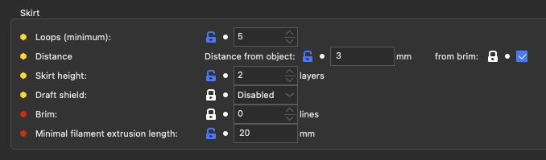
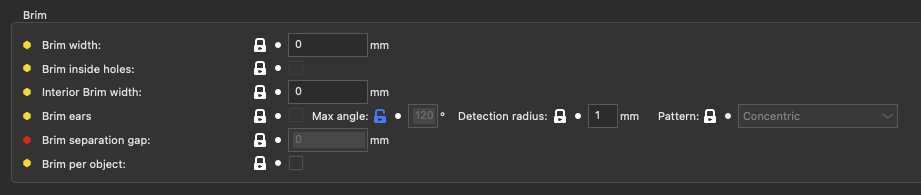

# Skirts and Brim

## Skirt

| Parameter                         | Parameter Name           | Parameter CLI flag         | Description                                                                                                                                                                                                                                                                                                                                                                | Default Value     |
| --------------------------------- | ------------------------ | -------------------------- | -------------------------------------------------------------------------------------------------------------------------------------------------------------------------------------------------------------------------------------------------------------------------------------------------------------------------------------------------------------------------- | ----------------- |
| Loops (Minimum)                   | skirts                   | --skirts                   | Number of loops for the skirt. If the Minimum Extrusion Length option is set, the number of loops might be greater than the one configured here. Set zero to disable skirt completely.                                                                                                                                                                                     | default: 1        |
| Distance from object              | skirt_distance           | --skirt-distance           | Distance between skirt and object(s) ; or from the brim if using draft shield or you set 'skirt_distance_from_brim'. (mm)                                                                                                                                                                                                                                                  | default: 6        |
| Distance from brim                | skirt_distance_from_brim | --skirt-distance-from-brim | The distance is computed from the brim and not from the objects                                                                                                                                                                                                                                                                                                            | default:          |
| Skirt height                      | skirt_height             | --skirt-height             | Height of skirt expressed in layers. Set this to a tall value to use skirt as a shield against drafts. (layers)                                                                                                                                                                                                                                                            | default: 1        |
| Draft shield                      | draft_shield             | --draft-shield             | With draft shield active, the skirt will be printed skirt_distance from the object, possibly intersecting brim. Enabled = skirt is as tall as the highest printed object. Limited = skirt is as tall as specified by skirt_height. This is useful to protect an ABS or ASA print from warping and detaching from print bed due to wind draft. (disabled, limited, enabled) | default: disabled |
| Brim                              | skirt_brim               | --skirt-brim               | Extra skirt lines on the first layer. (lines)                                                                                                                                                                                                                                                                                                                              | default: 0        |
| Minimal filament extrusion length | min_skirt_length         | --min-skirt-length         | Generate no less than the number of skirt loops required to consume the specified amount of filament on the bottom layer. For multi-extruder machines, this minimum applies to each extruder. (mm)                                                                                                                                                                         | default: 0        |

## Brim

| Parameter                  | Parameter Name             | Parameter CLI flag           | Description                                                                                                                                                                                                                                                                                     | Default Value       |
| -------------------------- | -------------------------- | ---------------------------- | ----------------------------------------------------------------------------------------------------------------------------------------------------------------------------------------------------------------------------------------------------------------------------------------------- | ------------------- |
| Brim width                 | brim_width                 | --brim-width                 | Horizontal width of the brim that will be printed around each object on the first layer. When raft is used, no brim is generated (use raft_first_layer_expansion). (mm)                                                                                                                         | default: 0          |
| Brim inside holes          | brim_inside_holes          | --brim-inside-holes          | Allow to create a brim over an island when it's inside a hole (or surrounded by an object). Incompatible with brim_width_interior, as it enables it with brim_width width.                                                                                                                      | default: false      |
| Interior Brim width        | brim_width_interior        | --brim-width-interior        | Horizontal width of the brim that will be printed inside each object on the first layer. (mm)                                                                                                                                                                                                   | default: 0          |
| Brim Ears                  | brim_ears                  | --brim-ears                  | Only draw brim over the sharp edges of the model.                                                                                                                                                                                                                                               | default: false      |
| Brim ears Max Angle        | brim_ears_max_angle        | --brim-ears-max-angle        | Maximum angle to let a brim ear appear. If set to 0, no brim will be created. If set to ~178, brim will be created on everything but straight sections. (°)                                                                                                                                     | default: 125        |
| Brim ears Detection radius | brim_ears_detection_length | --brim-ears-detection-length | The geometry will be decimated before dectecting sharp angles. This parameter indicates the minimum length of the deviation for the decimation. 0 to deactivate (mm)                                                                                                                            | default: 1          |
| Brim ears Pattern          | brim_ears_pattern          | --brim-ears-pattern          | Pattern for the ear. The concentric is the default one. The rectilinear has a perimeter around it, you can try it if the concentric has too many problems to stick to the build plate. (concentric, rectilinear)                                                                          | default: concentric |
| Brim seperation gap        | brim_separation            | --brim-separation            | Offset of brim from the printed object. Should be kept at 0 unless you encounter great difficulties to separate them. It's subtracted to brim_width and brim_width_interior, so it has to be lower than them. The offset is applied after the first layer XY compensation (elephant foot). (mm) | default: 0          |
| Brim per object            | brim_per_object            | --brim-per-object            | Create a brim per object instead of a brim for the plater. Useful for complete_object or if you have your brim detaching before printing the object. Be aware that the brim may be truncated if objects are too close together.                                                                 | default: false      |
