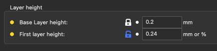
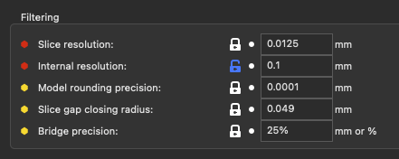
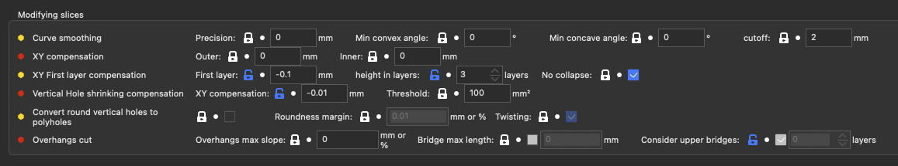
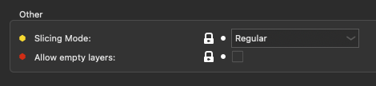

# Slicing

## Layer height

| Parameter          | Parameter Name     | Parameter CLI flag   | Description                                                                                                                                                                                                                                                                                                       | Default Value |
| ------------------ | ------------------ | -------------------- | ----------------------------------------------------------------------------------------------------------------------------------------------------------------------------------------------------------------------------------------------------------------------------------------------------------------- | ------------- |
| Base Layer height  | layer_height       |                      | This setting controls the height (and thus the total number) of the slices/layers. Thinner layers give better accuracy, but takes more time to print                                                                                                                                                              | default: 0.2  |
| First layer height | first_layer-height | --first-layer-height | When printing with very low layer heights, you might still want to print a thicker bottom layer to improve adhesion and tolerance for non perfect build plates. This can be expressed as an absolute value or as a percentage (for example: 75%) over the lowest nozzle diameter used in by the object. (mm or %) | default: 75%  |

## Filtering

| Parameter                | Parameter Name       | Parameter CLI Flag    | Description                                                                                                                                                                                                                                                                                                                                                                                     | Default Value   |
| ------------------------ | -------------------- | --------------------- | ----------------------------------------------------------------------------------------------------------------------------------------------------------------------------------------------------------------------------------------------------------------------------------------------------------------------------------------------------------------------------------------------- | --------------- |
| Slice resolution         | resolution           | --resolution          | Minimum detail resolution, used to simplify the input file for speeding up the slicing job and reducing memory usage. High-resolution models often carry more details than printers can render. Set zero to disable any simplification and use full resolution from input. Note: Slic3r has an internal working resolution of 0.0001mm. Infill & Thin areas are simplified up to 0.0125mm. (mm) | default: 0.0125 |
| Internal resolution      | resolution_internal  | --resolution-internal | Minimum detail resolution, used for internal structures (gapfill and some infill patterns). Don't put a too-small value, as it may create too many very small segments that may be difficult to display and print if your main resolution parameter is also very small. (mm)                                                                                                                    | default: 0.025  |
| Model rounding precision | model_precision      | --model-precision     | This is the rounding error of the input object. It's used to align points that should be in the same line. Set zero to disable. (mm)                                                                                                                                                                                                                                                            | default: 0.0001 |
| Slice gap closing radius | slice_closing_radius |                       | Cracks smaller than 2X gap closing radius are being filled during the triangle mesh slicing. The gap closing operation may reduce the final print resolution, therefor it is advisable to keep the value reasonably low.                                                                                                                                                                        | default: 0.049  |
| Bridge precision         | bridge_precision     | --bridge-precision    | This is the precision of the bridge detection. If you put it too low, the bridgedetection will be very inneficient. Can be a % of the bridge spacing. (mm or %)                                                                                                                                                                                                                                 | default: 25%    |

## Modifying slices

| Parameter                                                    | Parameter Name                            | Parameter CLI Flag                          | Description                                                                                                                                                                                                                                                                                                                                                                                                                           | Default Value  |
| ------------------------------------------------------------ | ----------------------------------------- | ------------------------------------------- | ------------------------------------------------------------------------------------------------------------------------------------------------------------------------------------------------------------------------------------------------------------------------------------------------------------------------------------------------------------------------------------------------------------------------------------- | -------------- |
| Curve smoothing - Precision                                  | curve_smoothing_precision                 | --curve-smoothing-precision                 | These parameters allow the slicer to smooth the angles in each layer. The precision will be at least the new precision of the curve. Set to 0 to deactivate. Note: as it uses the polygon's edges and only works in the 2D  planes, you must have a very clean or hand-made 3D model. It's really only useful to smoothen functional models or very wide angles. (mm)                                                                 | default: 0     |
| Curve smoothing - Min convex angle                           | curve_smoothing_angle_convex              | --curve-smoothing-angle-convex              | Minimum (convex) angle at a vertex to enable smoothing (trying to create a curve around the vertex). 180 : nothing will be smooth, 0 : all angles will be smoothened. (°)                                                                                                                                                                                                                                                             | default: 0     |
| Curve smoothing - Min concave angle                          | curve_smoothing_angle_concave             | --curve-smoothing-angle-concave             | Minimum (concave) angle at a vertex to enable smoothing (trying to create a curve around the vertex). 180 : nothing will be smooth, 0 : all angles will be smoothened. (°)                                                                                                                                                                                                                                                            | default: 0     |
| Curve smoothing - cutoff                                     | curve_smoothing_cutoff_dist               | --curve-smoothing-cutoff-dist               | Maximum distance between two points to allow adding new ones. Allow to avoid distorting long strait areas. Set zero to disable. (mm)                                                                                                                                                                                                                                                                                                  | default: 2     |
| XY Compensation - Outer                                      | xy_size_compensation                      | --xy-size-compensation                      | The object will be grown/shrunk in the XY plane by the configured value (negative = inwards = remove area, positive = outwards = add area). This might be useful for fine-tuning sizes. This one only applies to the 'exterior' shell of the object. !!! it's recommended you put the same value into the 'Inner XY size compensation', unless you are sure you don't have horizontal holes. !!! (mm)                                 | default: 0     |
| XY Compensation - Inner                                      | xy_inner_size_compensation                | --xy-inner-size-compensation                | The object will be grown/shrunk in the XY plane by the configured value (negative = inwards = remove area, positive = outwards = add area). This might be useful for fine-tuning sizes. This one only applies to the 'inner' shell of the object (!!! horizontal holes break the shell !!!) (mm)                                                                                                                                      | default: 0     |
| XY First layer compensation - First layer                    | first_layer_size_compensation             | --first-layer-size-compensation             | The first layer will be grown / shrunk in the XY plane by the configured value to compensate for the 1st layer squish aka an Elephant Foot effect. (should be negative = inwards = remove area) (mm)                                                                                                                                                                                                                                  | default: 0     |
| XY First layer compensation - height in layers               | first_layer_size_compensation_layers      | --first-layer-size-compensation-layers      | The number of layers on which the elephant foot compensation will be active. The first layer will be shrunk by the elephant foot compensation value, then the next layers will be gradually shrunk less, up to the layer indicated by this value. (layers)                                                                                                                                                                            | default: 1     |
| XY First layer compensation - No collapse                    | first_layer_size_compensation_no_collapse | --first-layer-size-compensation-no-collapse | The compensations won't shrink thin areas below a threshold for the first layer(s). The layer(s) where this is activated depends on the 'first_layer_size_compensation_layers' setting.                                                                                                                                                                                                                                               | default: true  |
| Vertical Hole shrinking compensation - XY Compensation       | hole_size_compensation                    | --hole-size-compensation                    | The convex holes will be grown / shrunk in the XY plane by the configured value (negative = inwards = remove area, positive = outwards = add area, should be negative as the holes are always a bit smaller irl). This might be useful for fine-tuning hole sizes. This setting behaves the same as 'Inner XY size compensation' but only for convex shapes. It's added to 'Inner XY size compensation', it does not replace it. (mm) | default: 0     |
| Vertical Hole shrinking compensation - Threshold             | hole_size_threshold                       | --hole-size-threshold                       | Maximum area for the hole where the hole_size_compensation will apply fully. After that, it will decrease down to 0 for four times this area. Set to 0 to let the hole_size_compensation apply fully for all detected holes (mm²)                                                                                                                                                                                                     | default: 100   |
| Convert round vertical holes to polyholes                    | hole_to_polyhole                          | --hole-to-polyhole                          | Search for almost-circular holes that span more than one layer and convert the geometry to polyholes. Use the nozzle size and the (biggest) diameter to compute the polyhole. See http://hydraraptor.blogspot.com/2011/02/polyholes.html                                                                                                                                                                                              | default: false |
| Convert round vertical holes to polyholes - Roundness margin | hole_to_polyhole_threshold                | --hole-to-polyhole-threshold                | Maximum deflection of a point to the estimated radius of the circle. As cylinders are often exported as triangles of varying size, points may not be on the circle circumference. This setting allows you some leeway to broaden the detection. In mm or in % of the radius. (mm or %)                                                                                                                                                | default: 0.01  |
| Convert round vertical holes to polyholes - Twisting         | hole_to_polyhole_twisted                  | --hole-to-polyhole-twisted                  | Rotate the polyhole every layer.                                                                                                                                                                                                                                                                                                                                                                                                      | default: true  |
| Overhangs cut - Overhangs max slope                          | overhangs_max_slope                       | --overhangs-max-slope                       | Maximum slope for overhangs. if at each layer, the overhangs hangs by more than this value, then the geometry will be cut. It doesn't cut into detected bridgeable areas. Can be a % of the highest nozzle diameter. Set to 0 to disable. (mm or %)                                                                                                                                                                                   | default: 0     |
| Overhangs cut - Bridge max length                            | overhangs_bridge_threshold                | --overhangs-bridge-threshold                | Maximum distance for bridges. If the distance is over that, it will be considered as overhangs for 'overhangs_max_slope'. If disabled, accept all distances. Set to 0 to ignore bridges. (mm)                                                                                                                                                                                                                                         | default: !0    |
| Overhangs cut - Consider upper bridges                       | overhangs_bridge_upper_layers             | --overhangs-bridge-upper-layers             | Don't put overhangs if the area will filled in next layer by bridges. If disabled, accept all upper layers. Set to 0 to only consider our layer bridges. (layers)                                                                                                                                                                                                                                                                     | default: 2     |

## Other

| Parameter          | Parameter Name     | Parameter CLI Flag   | Description                                                                                                                            | Default Value    |
| ------------------ | ------------------ | -------------------- | -------------------------------------------------------------------------------------------------------------------------------------- | ---------------- |
| Slicing Mode       | slicing_mode       | --slicing-mode       | Use "Even-odd" for 3DLabPrint airplane models. Use "Close holes" to close all holes in the model. (regular, even_odd, close_holes)     | default: regular |
| Allow empty layers | allow_empty_layers | --allow-empty-layers | Prevent the gcode builder from triggering an exception if a full layer is empty, and allow the print to start from thin air afterward. | default: false   |
